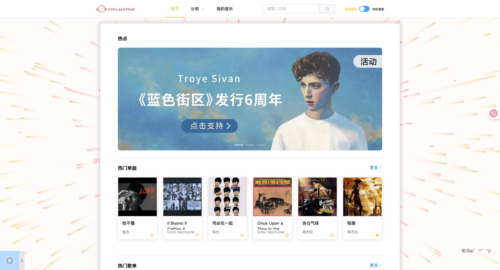

# CollapsTime

CollapsTime粗糙地实现了一个在线音乐点播系统。目的在于结合实践理解网页开发技术和数据库的基本知识以及后端服务设计，学习相关开发工具和应用软件，熟悉网站建设的过程。

本项目采用B/S体系结构，使用SpringBoot+Vue+ElementUI+Mybatis-plus进行开发，数据库使用Mysql5.7，一共包括两个系统，一个是用户使用的在线点播音乐系统，另一个是管理员进行操作的界面，对该系统进行管理。

### 本项目完成日期

2021/12/28
### 项目分工
| 模块            | 负责人   |
|-----------------|----------|
| 主页面前端      | RomanticMysteryLH    |
| 主页面后端      | zuozuozuo     |
| 后台管理前端    | vidocqklein     |
| 后台管理后端    | vidocqklein     |
### 界面展示

